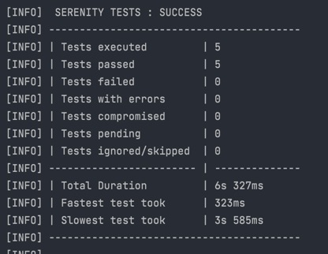
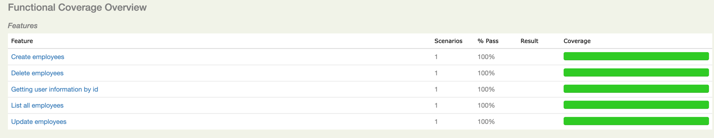
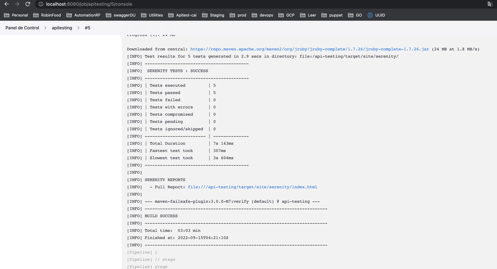
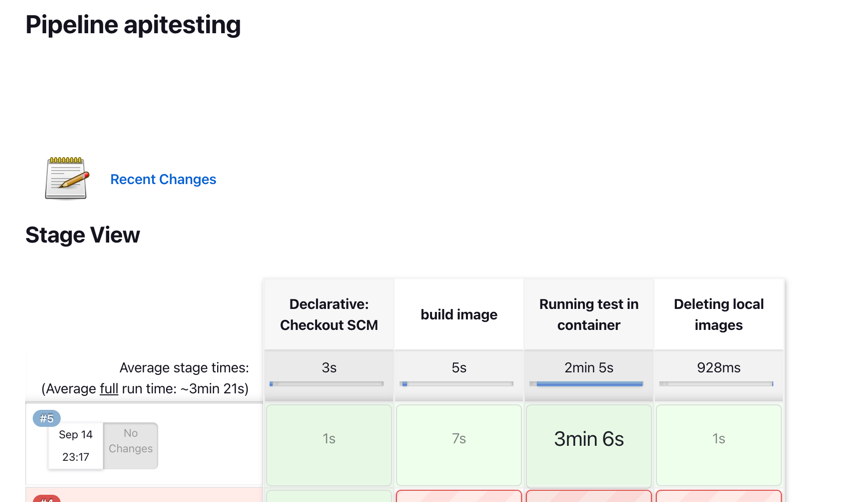

# apitesting-serenity-screenplay-rest
# Casos agregados
* Listar usuarios
* Listar usuario por ID
* Crear usuario
* Actualizar usuario

# Adicionales
* Validaciones de status code
* Validaciones de respuestas
* Manejo de modelos
* Reportes de serenity
* Implementación del patrón screenplay utilizando capas (exceptions, interactions, questions, tasks)
* Implementación de casos cucumber gherkin con Runner específico
* Dockerfile para construir imagen del proyecto y que corra los test al ejecutarse
* Jenkinsfile pipeline para ejecutar sobre cualquier base de jenkins -> Buildea imagen, Crea contenedor, Se ejecutan las pruebas y limpia el workspace
* Implementación de variables globales para disminuir la fragilidad de los test

# Stack manejado
* Cucumber Serenity
* Hamcrest
* Java 11
* Serenity Screenplay
* Serenity Rest
* Maven -> gestor de paquetes
* Serenity Reports

# Evidencias
# Ejecución de los Test

# Reporte Serenity

# Pipeline

